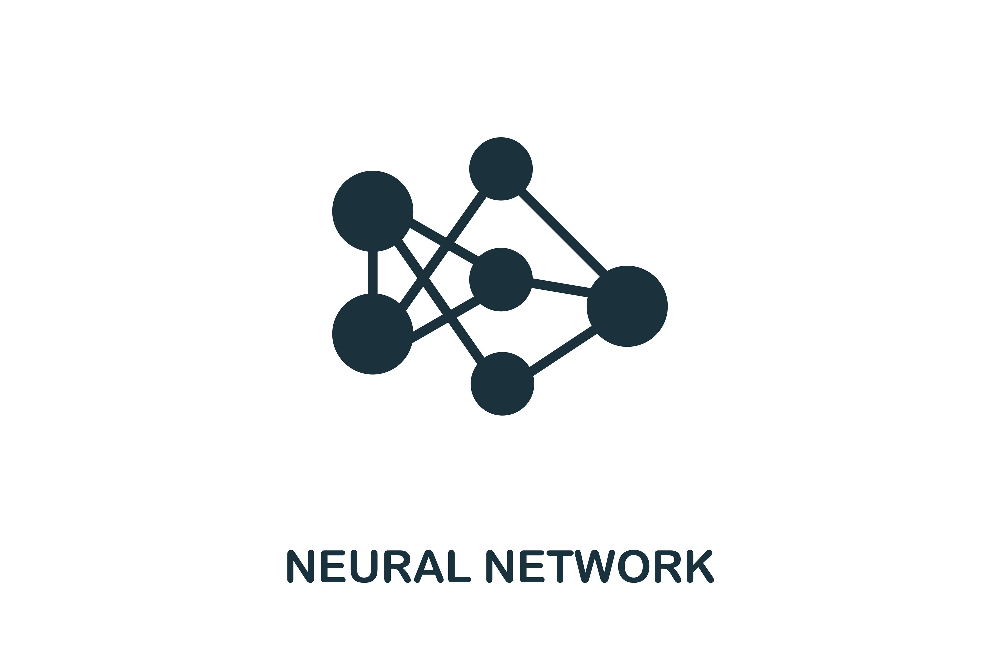

<!-- Template source: See: https://github.com/othneildrew/Best-README-Template -->
<a id="readme-top"></a>

[![Stargazers][stars-shield]][stars-url]
[![MIT License][license-shield]][license-url]
[![LinkedIn][linkedin-shield]](https://www.linkedin.com/in/arthur-testard/)


<!-- PROJECT LOGO -->
<br />
<div align="center">
  <a href="https://github.com/art-test-stack/homemade_neural_network">
    
  </a>

<h3 align="center">Homemade Neural Network</h3>

  <p align="center">
    This project does not have as purpose to be used to develop deep learning models. I just aim to develop this framework by myself to get a better understanding of how neural nets work, and for fun of course.
    <br />
    <a href="https://github.com/art-test-stack/homemade_neural_network"><strong>Explore the docs »</strong></a>
    <br />
    <br />
    <a href="https://github.com/art-test-stack/homemade_neural_network/issues/new?labels=enhancement&template=feature-request---.md">Request Feature</a>
  </p>
</div>


<!-- TABLE OF CONTENTS -->
<details>
  <summary>Table of Contents</summary>
  <ol>
    <li>
      <a href="#about-the-project">About The Project</a>
      <ul>
        <li><a href="#the-implementation">The implementation</a></li>
        <li><a href="#built-with">Built With</a></li>
      </ul>
    </li>
    <li>
      <a href="#getting-started">Getting Started</a>
      <ul>
        <li><a href="#installation">Installation</a></li>
        <li><a href="#create-a-dataset">Create a dataset</a></li>
        <li><a href="#create-a-model">Create a model</a></li>
        <li><a href="#train-the-model">Train the model</a></li>
      </ul>
    </li>
    <li><a href="#usage">Usage</a></li>
    <li><a href="#roadmap">Roadmap</a></li>
    <li><a href="#contributing">Contributing</a></li>
    <li><a href="#license">License</a></li>
    <li><a href="#contact">Contact</a></li>
  </ol>
</details>


<!-- ABOUT THE PROJECT -->
## About The Project

### The implementation

This project easily implement from scratch any feedforward network that you wish to model, using the famous backpropagation algorithm, popularized by the article [Learning representations by back-propagating errors](https://doi.org/10.1038/323533a0) written by **David E.Rumelhart**, **Geoffrey E. Hinton** and **Ronald J. Williams** (1986), to learn from the training samples.

The algorithm implemented is also well developed and explained in [Deep Learning](https://www.deeplearningbook.org/) by **Ian Goodfellow et al.** (2016): [Algorithm 6.4](https://www.deeplearningbook.org/contents/mlp.html#:~:text=NETWORKS-,Algorithm%206.4,-Backward).

It can handles different layers of different sizes, activation functions, loss functions and weight regularization. All of this is detailed bellow in [Create a model](#create-a-model).

### Built With

* [![Numpy][Numpy]][Numpy-url]
* [![React][Matplotlib]][Matplotlib-url]
* [![Sklearn][Sklearn]][Sklearn-url]
* [![Tqdm][Tqdm]][Tqdm-url]

<!-- <p align="right">(<a href="#readme-top">back to top</a>)</p> -->


<!-- GETTING STARTED -->
## Getting Started

### Installation

1. Clone the repo
   ```sh
   git clone git@github.com:art-test-stack/homemade_neural_network.git
   ```
2. Create a virtual environment
    
    For example I use [virtualenv](https://virtualenv.pypa.io/en/latest/):
   ```sh
   virtualenv -p python 3.10 venv
   ```
3. Install pip packages
   ```sh
   pip install -r requirements.txt
   ```

<!-- <p align="right">(<a href="#readme-top">back to top</a>)</p> -->


### Create a dataset:

Use MNIST or [doodle](datasets/doodle.py) dataset for image classification. 

You can easily create the [doodle dataset](datasets/doodle.py) by running 
```bash
python create_dataset.py
```

### Create a model:

To create a model architecture, you have to specify it in [configs/basic_config.yaml](configs/basic_config.yaml). You can change the path directory in [settings.py](configs/settings.py).

You have to specify the:

- Global parameters:
    - ```loss```: the loss function of the model for training. It can be ```'cross_entropy'``` or ```'mse'```(for now).
    - ```lrate```: the learning rate for training. It has to be a ```float```.
    - ```wrt```: the weight regularization type. It can be ```'L1'```, ```'L2'``` or ```None```.
    - ```wreg```: the regularization weight. It has to be a ```float```.

- Layers:
    - ```input```: the size of your (flattened) input. It has to be an ```int```.
    - ```hidden_layers```: is a list of layers with the following structure. 
        - ```size```: number of node of the layer. It has to be an ```int```.
        - ```act```: the activation function. It can be ```'sigmoid'```, ```'tanh'```, ```'linear'```, ```'relu'``` or ```'leaky_relu'```. Default: ```'linear'```.
        - ```wr```: weight range for initialization. It can be a tuple of two ```float```between those the weights are uniformaly initialized or it can be ```'glorot'```for Xavier Glorot weight initialization.
        - ```br```: same than ```wr``` for the biases.

<!-- <p align="right">(<a href="#readme-top">back to top</a>)</p> -->

### Train the model:

Just run:

```bash
python train.py
```

## Usage

This framework permits to easily create a neural network without coding, and to train it on any data. So, anyone who want to create a neural network but don't know how to code can use it as a first step to see how neural nets work !

However, I don't recommand it it's better to code lol.

<!-- <p align="right">(<a href="#readme-top">back to top</a>)</p> -->


<!-- ROADMAP -->
## Roadmap

- [ ] Change layers and module internal structure
- [ ] Change backpropagation call
- [ ] Add different optimizers than SGD
- [ ] Add reccurent and convolutional layers

<!-- See the [open issues](https://github.com/art-test-stack/homemade_neural_network/issues) for a full list of proposed features (and known issues). -->

<!-- <p align="right">(<a href="#readme-top">back to top</a>)</p> -->


<!-- CONTRIBUTING -->
## Contributing

Contributions are what make the open source community such an amazing place to learn, inspire, and create. Any contributions you make are **greatly appreciated**.

If you have a suggestion that would make this better, please fork the repo and create a pull request. You can also simply open an issue with the tag "enhancement".
Don't forget to give the project a star! Thanks again!

1. Fork the Project
2. Create your Feature Branch (`git checkout -b feature/AmazingFeature`)
3. Commit your Changes (`git commit -m 'Add some AmazingFeature'`)
4. Push to the Branch (`git push origin feature/AmazingFeature`)
5. Open a Pull Request

<!-- <p align="right">(<a href="#readme-top">back to top</a>)</p> -->


<!-- LICENSE -->
## License

Distributed under the MIT License. See `LICENSE.txt` for more information.

<!-- <p align="right">(<a href="#readme-top">back to top</a>)</p> -->


<!-- CONTACT -->
## Contact

Arthur Testard - testardarthur@gmail.com

Project Link: [https://github.com/art-test-stack/homemade_neural_network](https://github.com/art-test-stack/homemade_neural_network)

<p align="right">(<a href="#readme-top">back to top</a>)</p>


<!-- MARKDOWN LINKS & IMAGES -->
[contributors-shield]: https://img.shields.io/github/contributors/art-test-stack/homemade_neural_network.svg?style=for-the-badge
[contributors-url]: https://github.com/art-test-stack/homemade_neural_network/graphs/contributors
[forks-shield]: https://img.shields.io/github/forks/art-test-stack/homemade_neural_network.svg?style=for-the-badge
[forks-url]: https://github.com/art-test-stack/homemade_neural_network/network/members
[stars-shield]: https://img.shields.io/github/stars/art-test-stack/homemade_neural_network.svg?style=for-the-badge
[stars-url]: https://github.com/art-test-stack/homemade_neural_network/stargazers
[issues-shield]: https://img.shields.io/github/issues/art-test-stack/homemade_neural_network.svg?style=for-the-badge
[issues-url]: https://github.com/art-test-stack/homemade_neural_network/issues
[license-shield]: https://img.shields.io/github/license/art-test-stack/homemade_neural_network.svg?style=for-the-badge
[license-url]: https://github.com/art-test-stack/homemade_neural_network/blob/master/LICENSE.txt
[linkedin-shield]: https://img.shields.io/badge/-LinkedIn-black.svg?style=for-the-badge&logo=linkedin&colorB=555
[linkedin-url]: https://linkedin.com/in/arthur-testard
[product-screenshot]: images/screenshot.png
[Numpy]: https://img.shields.io/badge/numpy-000000?style=for-the-badge&logo=nextdotjs&logoColor=white
[Numpy-url]: https://numpy.org/
[Sklearn]: https://img.shields.io/badge/scikit--learn-%23F7931E.svg?style=for-the-badge&logo=scikit-learn&logoColor=white
[Sklearn-url]: https://scikit-learn.org/stable/
[Matplotlib]: https://img.shields.io/badge/Matplotlib-20232A?style=for-the-badge&logo=react&logoColor=61DAFB
[Matplotlib-url]: https://matplotlib.org/
[Tqdm]: https://img.shields.io/badge/tqdm-35495E?style=for-the-badge
[Tqdm-url]: https://tqdm.github.io/
